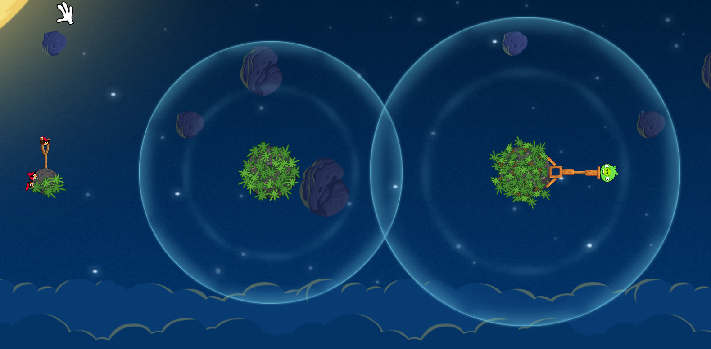

# Angry Birds Space Simulation

This MATLAB project simulates the motion of an angry bird through the gravitational fields of two planets in space. The simulation takes into account the gravitational forces and atmospheres of the planets, as well as the effects of drag on the bird's trajectory.

This project was done under supervision of Prof. Alireza Taheri at Sharif University of Technology by Amin Hashemi.
Hope you enjoy it
## Table of Contents
- [Introduction](#introduction)
- [Getting Started](#getting-started)
- [Dependencies](#dependencies)
- [Constants](#constants)
- [Simulation](#simulation)
- [Differential Equations](#differential-equations)
- [Event Handling](#event-handling)
- [Visualization](#visualization)
- [Conclusion](#conclusion)
- [Contact](#contact)

## Introduction
This MATLAB project simulates the iconic Angry Birds game in a space setting. The simulation showcases how an angry bird moves through the gravitational fields of two planets, interacting with their atmospheres and experiencing drag effects.

Note that the data points (`GameData-Tracker.txt`) was extracted by Tracker software from the scene of the game Angry Birds Space which is available below.

## Getting Started
To run the simulation, follow these steps:
1. Ensure you have MATLAB installed on your system or use online version of MATLAB.
2. Download or clone this repository to your local machine.
3. Place the `GameData-Tracker.txt` file in the same directory as the MATLAB scripts.
4. Open MATLAB and execute the `AngryBirdsSpace` function.

## Dependencies
The simulation uses MATLAB's built-in ODE solver `ode23` and event handling mechanism to detect collisions with the planets.

## Constants
Several constants are defined at the beginning of the script to set up the simulation parameters.

## Simulation
The simulation script runs for different values of the drag coefficient `k`. For each value of `k`, the script:
1. Sets up the constants and initial conditions.
2. Solves the system of ordinary differential equations using `ode23` and event handling.
3. Converts unitless time and positions to real time and coordinates.
4. Plots the trajectory of the angry bird along with the planets and their atmospheres.

## Differential Equations
The `fAngryBirdDiffEQ` function defines the system of differential equations that govern the bird's motion. It calculates the bird's acceleration based on gravitational forces from the planets and includes drag effects when inside planet atmospheres.

## Event Handling
The `eventsCollisionDetection` function is used for event detection to terminate the simulation when the bird collides with a planet. It checks whether the bird has entered the atmospheres of either planet and triggers an event when a collision occurs.

## Visualization
The simulation results are visualized using MATLAB's plotting capabilities. The trajectory of the angry bird is plotted along with the planets, their atmospheres, and the bird data from the `GameData-Tracker.txt` file.

## Conclusion
This repository provides a comprehensive Angry Birds Space Simulation, offering insights into the dynamics of motion in a gravitational field with atmospheric drag. By adjusting the drag coefficient `k`, you can observe various scenarios of the bird's trajectory.
