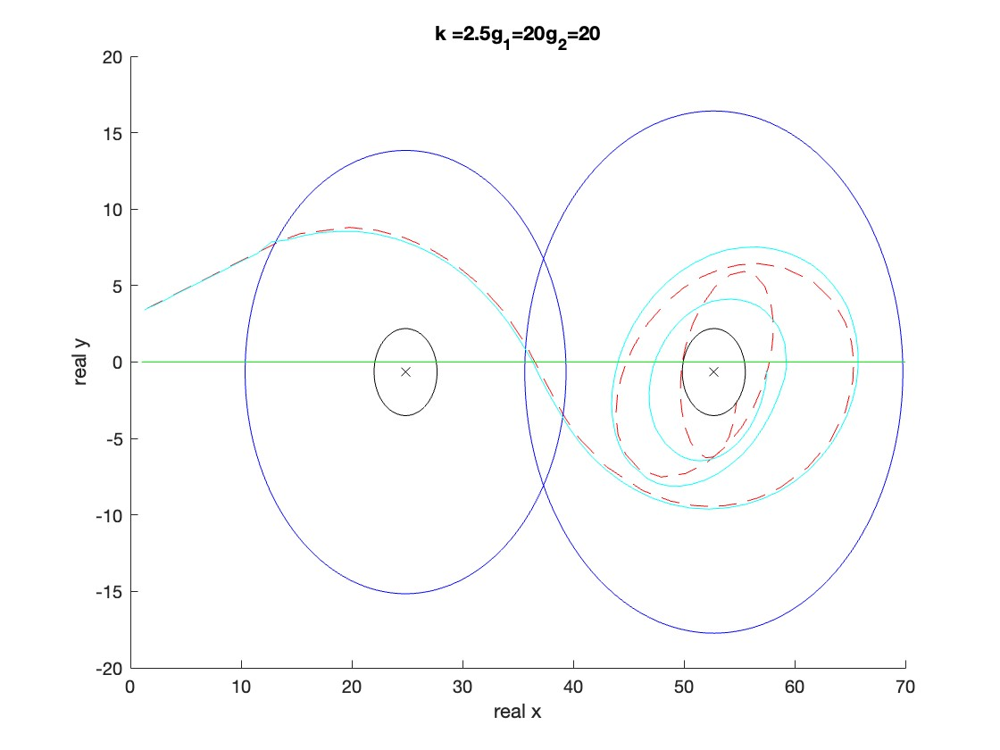

# 🚀 Angry Birds Space Simulation: Unleash the Bird's Cosmic Odyssey! 🐦🪐

Prepare to be captivated by the enchanting dance of an angry bird through the boundless expanse of space! Behold, the realm of Angry Birds transcends its gaming origins, as this MATLAB project unveils a mind-boggling simulation. Brace yourself for a cosmic voyage that traverses the gravitational realms of not one, but two celestial bodies. This isn't just a simulation; it's a symphony of forces, atmospheres, and drag effects intertwining to create a mesmerizing ballet of motion.

This stellar endeavor was crafted under the guiding light of Prof. Alireza Taheri at the illustrious Sharif University of Technology, with the indomitable Amin Hashemi at the helm.

Hope you relish this cosmic journey as much as we did. 🌌

## 📚 Table of Celestial Contents

- [Introduction](#introduction)
- [Launching the Odyssey](#getting-started)
- [Instruments of Celestial Harmony](#dependencies)
- [Universal Constants](#constants)
- [Celestial Choreography](#simulation)
- [Celestial Equations](#differential-equations)
- [Cosmic Event Handling](#event-handling)
- [Celestial Visualization](#visualization)
- [Cosmic Encore](#conclusion)
- [Stellar Communication](#contact)

## 🌌 Introduction: A Cosmic Prelude

Step into the shoes of the iconic Angry Birds game, but this time, in the cosmic theater. This spellbinding MATLAB project brings you the Angry Birds saga in an otherworldly setting. Behold the saga of an angry bird as it dances through the gravitational domains of two captivating planets, embracing their atmospheres, and defying the pull of drag effects.

But hold on, there's more! The data points in `GameData-Tracker.txt` were extracted using the mystical Tracker software, derived from the enigmatic scenes of Angry Birds Space. Gaze upon the cosmic canvas that inspired it all:

## 🚀 Launching the Odyssey

Ready to embark on this cosmic journey? Your voyage awaits:

1. Ensure that the celestial realm of MATLAB graces your machine, or bask in the glory of the online MATLAB universe.
2. Gently cradle this repository, either by downloading or invoking the clone ritual on your local sanctum.
3. Nestle the `GameData-Tracker.txt` in the same dwelling as your MATLAB scripts.
4. Open the sacred gates of MATLAB and let the cosmos awaken as you execute the mighty `AngryBirdsSpace` function.

## 🔮 Instruments of Celestial Harmony

Drawing upon the cosmic magic of MATLAB, this simulation employs the wondrous `ode23` solver and invokes celestial events to detect ethereal collisions with the planets.

## 🌠 Universal Constants: Keys to the Celestial Symphony

At the inception of our cosmic ballet, sacred constants are summoned forth to weave the fabric of our simulation's parameters.

## ✨ Celestial Choreography: The Dance of Simulation

The stage is set, the planets await their cosmic dance partner. The cosmic choreography unfolds in a series of steps:
1. The cosmic constants and initial conditions take their places.
2. The system of differential equations graces the cosmic stage, elegantly solved by `ode23` and entwined with event handling.
3. The cosmic dance transcends to the realm of reality, as unitless time and positions transform into tangible coordinates and moments.
4. Behold, the celestial dance in all its glory! The trajectory of the angry bird etches across the cosmic canvas, planets and atmospheres joining the ballet.

## ⚙️ Celestial Equations: The Essence of Cosmic Motion

The intricate `fAngryBirdDiffEQ` function, an epitome of cosmic wisdom, weaves the fabric of motion. With gravitational forces and drag effects at its command, it calculates the bird's acceleration as it soars through cosmic domains.

## 🌟 Cosmic Event Handling: When Worlds Collide

The cosmic event handler, known as `eventsCollisionDetection`, is summoned to detect the cosmic embrace between the bird and the planets. The dance of collision unfolds as the bird ventures into the embrace of a planet's atmosphere, triggering an ethereal event.

## 🪐 Celestial Visualization: Crafting Cosmic Tales

Behold the celestial tapestry unfold! Using the mystic powers of MATLAB's visual prowess, the cosmic voyage is unveiled. Witness the trajectory of the fiery bird amidst the cosmic canvas adorned with planets, atmospheres, and the celestial data from the `GameData-Tracker.txt`.

## 🎉 Cosmic Encore: A Celestial Curtain Call

And thus, our cosmic tale reaches its celestial crescendo. This repository is your gateway to a comprehensive Angry Birds Space Simulation, offering insights into the dance of motion under gravitational influence and atmospheric drag. Adjust the celestial parameter `k` to unravel diverse trajectories, each a cosmic masterpiece in its own right.

With Cosmic Wonder,
Amin Hashemi
